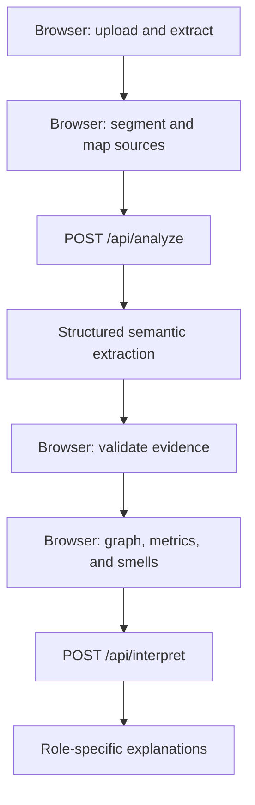

# Architecture

## Technology choices

| Concern | Choice |
|---|---|
| Framework | Next.js App Router |
| Language/UI | TypeScript, Tailwind CSS, shadcn/ui, Lucide React |
| Graph | Cytoscape.js; Dagre default, CoSE-Bilkent optional |
| Animation | Framer Motion |
| AI | OpenAI Responses API with Structured Outputs |
| Runtime validation | Zod |
| Document extraction | `pdfjs-dist`/`unpdf`, `mammoth` |
| Persistence | IndexedDB through Dexie |
| Interaction state | Zustand |
| Deployment | Vercel |

The OpenAI key must never reach the browser. AI calls go through stateless
Next.js Route Handlers.

## Processing boundary



Browser responsibilities include file validation, document extraction, the
clause/source model, IndexedDB storage, interaction state, graph construction,
deterministic analytics, and Cytoscape rendering. Route handlers validate the
request, call the model, and return structured semantic output or explanations;
they do not persist contracts.

## Suggested source structure

```text
src/
  app/
    page.tsx
    contract/{graph,smells,dependencies,explainability,negotiation,compare}/
    api/{analyze,interpret,negotiate,legal-check}/
  components/{ui,upload,graph,evidence,findings,diagnostics,diff}/
  features/
    ingestion/ segmentation/ extraction/ graph-builder/ graph-analytics/
    contract-linter/ explainability/ legal-validation/ contract-diff/ negotiation/
  lib/{ai,documents,graph,validation,storage}/
  schemas/
  store/ui.store.ts
  db/local-workspace.ts
```

Domain logic belongs in feature/lib modules, not page components. Schemas are
the boundary between AI output and trusted application state.

## Document pipeline

- Preserve each page's original and normalized text plus global offsets.
- Segment deterministically using numbering, headings, indentation, line breaks,
  labels, hierarchy, and explicit cross-references.
- Use AI for segmentation only when the deterministic result is ambiguous.
- Preserve source text exactly; never accept an AI-regenerated clause.
- Retain extracted text, clauses, page references, graph JSON, evidence, findings,
  and analysis metadata. Avoid storing original blobs unless exact rendering
  after refresh is required.

## State ownership

Dexie owns durable browser-local contract sessions. Zustand contains only
transient UI state such as selection, hover, filters, highlighted paths, inspector
visibility, reasoning mode, and the active contract. Do not duplicate the full
graph across multiple state stores.

Uploading a new file when both slots matter must offer: replace primary, replace
comparison, or clear workspace.

## Privacy and security

- Never persist contracts on the server or expose the API key.
- Avoid logging complete contract text or clauses in production telemetry.
- Process files transiently and explain that IndexedDB is device-specific.
- Provide a clear-local-workspace action.
- Present Claux as an analysis aid, not legal advice.